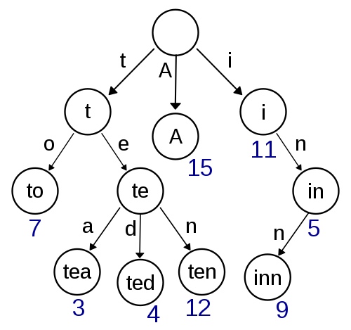

# Literature Review

This is where the literature review lives. It's a breathing document, with no final draft intended.

## Scope of this Work
Let's assume a few things exist:
1. A low-error labeling scheme, such that any resource is ideally represented with certain data, and all data necessary to its classification exists
2. A generous library budget, and reasonably modern/novel technology options 

If the above things exist, this means that this work does not consider itself responsible for (respectively):
1. presenting a labeling scheme for resources
2. accommodating all possible libraries in setup, budget, or expertise

That leaves the following as the sought goals for this work:
1. demonstrating an _n_-dimensional universe of knowledge for some constraints on _n_
2. a classification notation for the resultant _n_-d graph, for some constraints on _n_
3. an acknowledgement on the gap between the potentially wildly different ranges of _n_ in 1. and 2.
4. an elaboration of (and potentially solutions to) the logistical shelving challenges presented by adoption of such a classification scheme

## Classification Schemes and Notation

### References

> J. P. Comaromi. Book Numbers. 1981

This book blows my mind in so many ways. I LOVE it. I need my own copy.

## Faceted Classification

### (Future) References
> Pratt, W., M. Hearst and L. Fagan. 1999. “A Knowledge- Based Approach to Organizing Retrieved Docu- ments.” AAAI-99: Proceedings of the Sixteenth National Conference on Artificial Intelligence, Orlando, Florida, 1999, edited by Jim Hendler and Devika Subramanian. Cambridge, MA: MIT Press, 80-5.

> Wu, M., M. Fuller and R. Wilkinson. 2001. “Using Cluster- ing and Classification Approaches in Interactive Re- trieval.” Information Processing & Management 37(3): 459-84.

## Indexing
Indexing seems to be a natural extension of _n_-D classification, since its structure is many-to-many (of general terms to specific resources). Understanding what's current in indexing will be important, at least at the outset.

### References

> Citation Indexing and Indexes. de Araújo, P. C., Castanha, R. C. G. and Hjørland, B. (2021).

This resource seemed interesting, but was very focused on a general overview of citation indexes specifically. This doesn't seem very useful to me currently.

## Information Retrieval
My thinking here is that one way to model a classification scheme could be similar to how an information network (**TODO** look up the actual word/term for what I'm trying to say here) works. The reason this could be useful is because a lot of information retrieval (IR) algorithms use graphs/networks at their core, so understanding usability and efficiency through IR can help provide a rationale for upending classification schemes. 

### References

> A bias–variance evaluation framework for information retrieval systems. Zhang, P. et al. (2021)

Provides a really nice overview of bias/variance in retrieval systems, in addition to demonstrating the latest and greatest in the theoretical basis for system tradeoffs. I'd like to come back to this work when covering alternative ways of thinking about classification systems.

> M. Wu, Y.-H. Liu, R. Brownlee, X. Zhang. Evaluating Utility and Automatic Classification of Subject Metadata

Describes how subject headings (including with automatic classification) help with usability/user experience, and improve retrieval. This resource seems really useful to me, especially since it has a good background section and provides good support for other types of classification schemes.

> [https://en.wikipedia.org/wiki/Trie](https://en.wikipedia.org/wiki/Trie); [https://en.wikipedia.org/wiki/Radix_tree](https://en.wikipedia.org/wiki/Radix_tree)

A hierarchical classification scheme can be represented as a Trie (sometimes referred to as a prefix tree). This is great because now we have a clear computer science structure that we can use to apply tree-based concepts to classification schemes.

## Visualization/Conceptualization of Knowledge

To be able to pick a graph structure that most accurately represents a knowledge graph, it's important to have researched what the current thinking in this field is. 

### References
> Visual conceptualizations and models of science. Katy Börner, K. and Scharnhorst, A. (2009)

This paper gave me a lot to think about, namely, where I am proposing a structure onto an existing plane, versus the plane demonstrates a structure to me. (That might not make a lot of sense, apologies.) Lots of good quotes and highlights in this paper. Be sure to keep referencing later.

## Shower Thoughts
- is it topological sort that does the thing where if A has children B and C, and C has children D and E, and B has child E, then printing the tree makes sure all children come after their parent(s)?